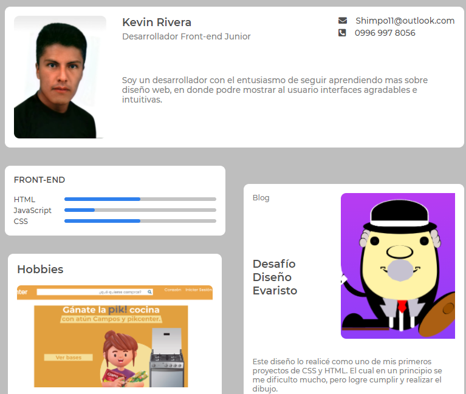

# Portafolio
Creacion de mi portafolio personal

    

# Portafolio de Kevin Rivera - Desarrollador Front-end Junior

Este es mi portafolio personal donde muestro una variedad de proyectos y habilidades relacionadas con el desarrollo web. Puedes encontrar una colección de proyectos realizados utilizando HTML, CSS y JavaScript, así como información sobre mis habilidades y experiencias. Siéntete libre de explorar y contactarme si tienes alguna pregunta o colaboración.

## Contenido

- [Portafolio de Kevin Rivera - Desarrollador Front-end Junior](#portafolio-de-kevin-rivera---desarrollador-front-end-junior)
  - [Contenido](#contenido)
  - [Descripción](#descripción)
  - [Proyectos Destacados](#proyectos-destacados)
  - [Habilidades](#habilidades)
  - [Experiencias](#experiencias)
  - [Hobbies](#hobbies)

## Descripción

Este portafolio está diseñado para mostrar mi progreso como Desarrollador Front-end Junior. Aquí presento proyectos personales y desafíos que he abordado para mejorar mis habilidades en diseño web y programación. Además, proporciono información sobre mis experiencias y habilidades en el campo del desarrollo web.

## Proyectos Destacados

Aquí están algunos de los proyectos que he realizado:

1. [Proyecto Tarjetas](https://github.com/KevinRivera1/proyecto_css1): Réplica de tarjetas utilizando HTML y CSS.
2. [Página Desafío](https://github.com/KevinRivera1/Page-heckout-desafio): Diseño de página de compra y pago de artículos.
3. [Página Blog](https://github.com/KevinRivera1/Pag--Blog-personal): Diseño de un blog personal utilizando HTML y CSS.
4. [Página Web Deportes](https://github.com/KevinRivera1/HTML-CSS-3): Diseño de página de deportes olímpicos colaborativa.
5. [Diseño de Login](https://github.com/KevinRivera1/HTML-CSS-3): Diseño de interfaz de inicio de sesión.
6. [Diseño de Registro](https://github.com/KevinRivera1/Registro-con-HTML-CSS): Diseño de interfaz de registro de usuario.
7. [DISEÑO de 404 NOT FOUND](https://github.com/KevinRivera1/Error-404): Diseño de página de error 404.
8. [Galería Con Grid](https://github.com/KevinRivera1/Galeria-Grid): Diseño de galería de fotos utilizando CSS Grid.
9. [Diseño de Página de Noticias](https://github.com/KevinRivera1/Pagina-Noticias): Diseño de página de noticias internacionales.
10. [Memory Game](https://github.com/KevinRivera1/Juego-JavaScript-Uno): Juego para mejorar la memoria.
11. [Juego Snake](https://github.com/KevinRivera1/Juego-JavaScript-2): Versión del juego Snake utilizando JavaScript.
12. [Juego Tetris](https://github.com/KevinRivera1/Juego-Tetris): Versión del juego Tetris utilizando JavaScript.
13. [Formulario Reserva](https://github.com/KevinRivera1/Formulario-Reserva-Tradicional): Diseño de formulario de reservas tradicional.
14. [Formulario Reserva de Laboratorios](https://github.com/KevinRivera1/Formulario-Reserva-Laboratorios): Diseño de formulario de reservas de laboratorios.

## Habilidades

- **HTML:** Experto
- **CSS:** Experto
- **JavaScript:** Intermedio

## Experiencias

- **Html:** Desde septiembre de 2021 hasta la actualidad. He adquirido experiencia en su implementación para varios proyectos.
- **CSS:** Desde septiembre de 2021 hasta la actualidad. He utilizado CSS para darle apariencia a mis proyectos.
- **JavaScript:** Desde septiembre de 2021 hasta la actualidad. Aprendiendo y aplicando JavaScript en proyectos.

## Hobbies

1. **Hacer Deporte:** Siempre me ha gustado hacer deporte, especialmente jugar fútbol, lo cual me ayuda a despejar la mente y mantenerme enérgico.
2. **Soy Guitarrista:** Tocar la guitarra es uno de mis pasatiempos desde hace 15 años. Me divierte y me relaja.
3. **Realizar Arte con Sprays:** Me relajo realizando arte utilizando sprays, lo que me permite ser creativo y experimentar con diferentes estilos.

## Contacto

Si deseas ponerte en contacto conmigo para colaboraciones o proyectos, no dudes en enviarme un correo electrónico a [Ejemplo@gmail.com](mailto:Ejemplo@gmail.com) o llamarme al 0999 999 9999.

¡Gracias por visitar mi portafolio!
